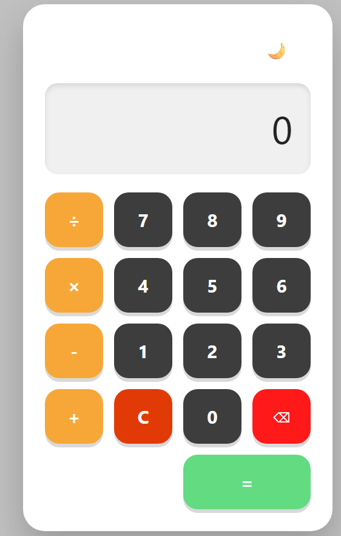
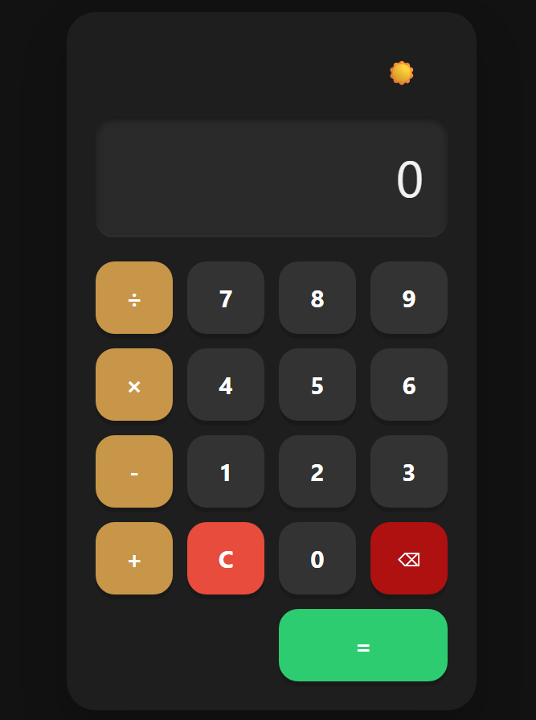

# React + TypeScript + Vite

Calculadora dedsenvolvida com React e TypeScript, totalmente estilizada com CSS puro. Foram três etapas, UI/UX, depois lógica e robustez e por fim refino e interatividade.
Como rodar? clone o repositório, instale as dependênciass (npm install) e por fim inicie o servidor (nnpm run dev).

  
<strong>Modo Claro e Modo Escuro</strong>

  

  

